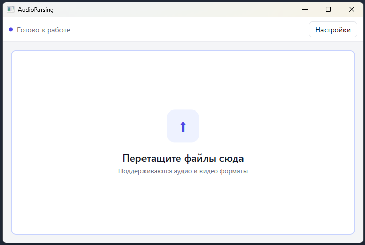

# AudioParsing

AudioParsing — приложение для автоматической расшифровки аудио и видеофайлов.
Программа распознаёт аудиодорожку (внешний RouterAI Whisper или локальная модель GigaAM-v3), создает краткое содержание с помощью языковой модели (внешняя RouterAI luna или локальный GigaChat GGUF) и сохраняет результат в Markdown-файл рядом с исходным медиафайлом.

Проект включает графическое приложение для Windows и консольный интерфейс.

## Возможности

- Перетаскивание аудио- и видеофайлов в окно приложения.
- Рекурсивный поиск медиафайлов во вложенных папках.
- Поддержка аудиоформатов `.mp3`, `.m4a`, `.wav`, `.flac`, `.ogg`, `.opus`, `.wma`, `.aac` и других.
- Поддержка видеоформатов `.mp4`, `.m4v`, `.mkv`, `.mov`, `.avi`, `.webm`, `.wmv`, `.flv`, `.mpg`, `.3gp`, `.mts`, `.m2ts`.
- Извлечение аудиодорожки из видео и сжатие больших аудиофайлов через FFmpeg.
- Выбор движка распознавания: внешний `openai/whisper-large-v3-turbo` (по умолчанию) или локальный GigaAM-v3 (на устройстве, через sherpa-onnx).
- Выбор движка суммаризации: внешний `openai/gpt-6-luna` (по умолчанию) или локальный GigaChat3.1 GGUF (на устройстве, через LLamaSharp). Пара «локальный + локальный» работает полностью офлайн, без API-ключа.
- Сохранение краткого содержания, ключевых слов и полного транскрипта в соседний `.md`-файл.
- Пропуск уже обработанных файлов с возможностью принудительного повторного запуска.
- Отображение этапов обработки, ошибок и результатов в графическом интерфейсе.
- Настройка пути к FFmpeg и используемых моделей через окно настроек или `appsettings.json`.

## Скриншот



## Требования

- Windows для графического приложения.
- .NET SDK 10.0 или новее.
- FFmpeg.
- API-ключ [RouterAI](https://routerai.ru/).

Консольный проект и библиотека ядра рассчитаны на `net10.0`. WPF-приложение рассчитано на `net10.0-windows`.

## Настройка

### 1. Установка FFmpeg

Установите FFmpeg и убедитесь, что исполняемый файл доступен по пути, указанному в настройках. Значение по умолчанию:

```text
C:\Program Files (x86)\ffmpeg\ffmpeg.exe
```

Путь можно изменить в окне «Настройки» или в файле `appsettings.json`:

```json
{
  "FfmpegPath": "C:\\Program Files (x86)\\ffmpeg\\ffmpeg.exe",
  "TranscriptionBackend": "External",
  "TranscriptionModel": "openai/whisper-large-v3-turbo",
  "SummaryBackend": "External",
  "SummaryModel": "openai/gpt-6-luna",
  "Language": "ru",
  "GigaAm": {
    "ModelPath": "models/gigaam-v3",
    "EncoderFileName": "encoder.onnx",
    "DecoderFileName": "decoder.onnx",
    "JoinerFileName": "joiner.onnx",
    "TokensFileName": "tokens.txt"
  },
  "GigaChat": {
    "GgufPath": "models/GigaChat3.1-10B-A1.8B-q4_K_M.gguf",
    "ContextSize": 16384,
    "GpuLayerCount": 0
  }
}
```

`TranscriptionBackend`: `External` — RouterAI Whisper (по умолчанию), `Local` — локальный GigaAM-v3.
`SummaryBackend`: `External` — RouterAI luna (по умолчанию), `Local` — локальный GigaChat GGUF.
`Language`: код языка (`ru` по умолчанию, `auto` — не передавать язык).

### 2. Настройка API-ключа

Приложение читает ключ RouterAI из переменной окружения `ANTHROPIC_AUTH_TOKEN`.
Ключ нужен, только если распознавание или суммаризация используют внешний движок.
Пара «локальный + локальный» работает полностью офлайн, без ключа и без сети.

В PowerShell:

```powershell
$env:ANTHROPIC_AUTH_TOKEN = "ваш-api-ключ"
```

Не добавляйте API-ключ в репозиторий, `appsettings.json` или README.

### 3. Локальная модель GigaAM-v3 (необязательно)

**Автоматически (рекомендуется).** Скачивание ~890 МБ с Hugging Face
(репозиторий `Smirnov75/GigaAM-v3-sherpa-onnx`, вариант e2e_rnnt с пунктуацией).
Файлы сохраняются в подкаталог `models/gigaam-v3` рядом с приложением, а их имена
прописываются в настройки (вариант «Б» ниже):

```powershell
dotnet run --project src/AudioParsing.Console -- --download-gigaam
```

Команда покажет список файлов и запросит подтверждение (`y/N`), пропустит уже
скачанные файлы, отобразит прогресс и обновит секцию `GigaAm` в `appsettings.json`.
Каталог можно переопределить через `--gigaam-model <path>`.

В графическом приложении — кнопка «Скачать…» в окне «Настройки» (с подтверждением
и индикатором прогресса); после скачивания нажмите «Сохранить».

**Вручную.** Для движка «Локальный (GigaAM-v3)» нужны 4 файла из репозитория
`Smirnov75/GigaAM-v3-sherpa-onnx` на Hugging Face (вкладка Files).
Берите вариант **e2e_rnnt** — он добавляет пунктуацию, что заметно лучше для лекций:

- `gigaam_v3_e2e_rnnt_encoder.onnx` (885 МБ; либо `gigaam_v3_e2e_rnnt_encoder_int8.onnx`,
  319 МБ — быстрее и компактнее, чуть менее точный)
- `gigaam_v3_e2e_rnnt_decoder.onnx`
- `gigaam_v3_e2e_rnnt_joint.onnx` (обратите внимание: на Hugging Face файл называется
  *joint*, а настройка в приложении — `JoinerFileName`)
- `gigaam_v3_e2e_rnnt_tokens.txt`

(Вариант без префикса `e2e_` — `gigaam_v3_rnnt_*.onnx` — тоже подойдёт, но распознаёт
без пунктуации. Варианты `ctc` приложению не подходят: нужен именно набор
transducer из 4 файлов.)

Положите все 4 файла в один каталог, например `D:\models\gigaam-v3`. Дальше два способа:

**Способ А — переименовать** файлы в `encoder.onnx`, `decoder.onnx`, `joiner.onnx`,
`tokens.txt` (совпадает со значениями по умолчанию). Тогда в настройках достаточно
указать только каталог:

```json
"GigaAm": {
  "ModelPath": "D:\\models\\gigaam-v3"
}
```

**Способ Б — оставить имена как есть** и прописать их в настройках целиком:

```json
"GigaAm": {
  "ModelPath": "D:\\models\\gigaam-v3",
  "EncoderFileName": "gigaam_v3_e2e_rnnt_encoder.onnx",
  "DecoderFileName": "gigaam_v3_e2e_rnnt_decoder.onnx",
  "JoinerFileName": "gigaam_v3_e2e_rnnt_joint.onnx",
  "TokensFileName": "gigaam_v3_e2e_rnnt_tokens.txt"
}
```

Каталог задаётся в поле `GigaAm.ModelPath` (`appsettings.json`, окно «Настройки»
с кнопкой «Обзор…» или параметр `--gigaam-model`). Относительный путь трактуется
относительно папки приложения (рядом с исполняемым файлом). Итоговая структура каталога:

```text
D:\models\gigaam-v3\
  encoder.onnx
  decoder.onnx
  joiner.onnx
  tokens.txt
```

Обратите внимание: суммаризация через RouterAI luna используется, только если движок
суммаризации — внешний. При паре «локальный + локальный» переменная
`ANTHROPIC_AUTH_TOKEN` не нужна.

### 4. Локальная модель GigaChat (необязательно)

Для движка суммаризации «Локальный (GigaChat GGUF)» нужен файл
`GigaChat3.1-10B-A1.8B-q4_K_M.gguf` (~6 ГБ) из официального MIT-репозитория
`ai-sage/GigaChat3.1-10B-A1.8B-GGUF` на Hugging Face.

**Автоматически (рекомендуется):**

```powershell
dotnet run --project src/AudioParsing.Console -- --download-gigachat
```

Команда покажет источник и целевой файл, запросит подтверждение (`y/N`), пропустит
уже скачанный файл, отобразит прогресс и сохранит секцию `GigaChat` в
`appsettings.json` (а также выставит `SummaryBackend: Local`, если движок ещё не
выбран). Путь можно переопределить через `--gigachat-model <path>` (каталог или файл).

В графическом приложении — кнопка «Скачать…» рядом с полем модели GigaChat в окне
«Настройки» (с подтверждением и индикатором прогресса); после скачивания нажмите
«Сохранить».

Длинные транскрипты локальный движок обрабатывает по частям (map-reduce) с тем же
системным промптом, поэтому формат результата совпадает с внешним движком.
Используется CPU (`GpuLayerCount: 0`).

### 5. Проверка подключения

Консольный режим поддерживает отдельную проверку подключения к RouterAI:

```powershell
dotnet run --project src/AudioParsing.Console -- --routerai-check
```

## Запуск графического приложения

Соберите и запустите WPF-приложение:

```powershell
dotnet run --project src/AudioParsing.Win
```

В открывшееся окно перетащите один или несколько поддерживаемых медиафайлов. Для каждого исходного файла будет создан файл с тем же именем и расширением `.md`.

Например:

```text
lecture.m4a  ->  lecture.md
interview.mp4 -> interview.md
```

Если Markdown-файл уже существует, файл пропускается. Для повторной обработки используйте консольный параметр `--force` или удалите существующий Markdown-файл.

## Консольный режим

Запуск обработки текущей папки:

```powershell
dotnet run --project src/AudioParsing.Console
```

Обработка указанной папки:

```powershell
dotnet run --project src/AudioParsing.Console -- "C:\Media\Lectures"
```

То же через именованный параметр:

```powershell
dotnet run --project src/AudioParsing.Console -- --folder "C:\Media\Lectures"
```

Выбор языка речи:

```powershell
dotnet run --project src/AudioParsing.Console -- --folder "C:\Media" --language ru
```

Автоматическое определение языка:

```powershell
dotnet run --project src/AudioParsing.Console -- --folder "C:\Media" --language auto
```

Принудительная повторная обработка:

```powershell
dotnet run --project src/AudioParsing.Console -- --folder "C:\Media" --force
```

Локальное распознавание через GigaAM-v3:

```powershell
dotnet run --project src/AudioParsing.Console -- --folder "C:\Media" --backend local
```

С явным указанием каталога модели:

```powershell
dotnet run --project src/AudioParsing.Console -- --folder "C:\Media" --backend local --gigaam-model "D:\models\gigaam-v3"
```

Локальная суммаризация через GigaChat (без luna):

```powershell
dotnet run --project src/AudioParsing.Console -- --folder "C:\Media" --summary-backend local
```

Полностью офлайн (без `ANTHROPIC_AUTH_TOKEN`):

```powershell
dotnet run --project src/AudioParsing.Console -- --folder "C:\Media" --backend local --summary-backend local
```

С явным указанием GGUF-файла:

```powershell
dotnet run --project src/AudioParsing.Console -- --folder "C:\Media" --summary-backend local --gigachat-model "D:\models\GigaChat3.1-10B-A1.8B-q4_K_M.gguf"
```

Справка по параметрам:

```powershell
dotnet run --project src/AudioParsing.Console -- --help
```

## Формат результата

Для каждого медиафайла создается соседний Markdown-файл, содержащий:

- название исходного файла;
- дату обработки;
- краткое содержание;
- ключевые слова;
- полный текст транскрипции.

Файлы, которые не удалось обработать, не останавливают обработку остальных файлов. Их ошибки выводятся в консоль или журнал приложения.

## Сборка и тестирование

Сборка решения в конфигурации Release:

```powershell
dotnet build AudioParsing.sln --configuration Release
```

Запуск тестов:

```powershell
dotnet test AudioParsing.sln --configuration Release
```

Проверка форматирования:

```powershell
dotnet format AudioParsing.sln --verify-no-changes
```

## Структура проекта

```text
src/
  AudioParsing.Core/       Ядро: поиск файлов, FFmpeg, RouterAI и Markdown
  AudioParsing.LocalStt/   Локальное распознавание GigaAM-v3 через sherpa-onnx
  AudioParsing.LocalSummary/ Локальная суммаризация GigaChat GGUF через LLamaSharp
  AudioParsing.Console/    Консольный интерфейс
  AudioParsing.Win/        WPF-интерфейс для Windows
tests/
  AudioParsing.Tests/      Тесты ядра и консольной конфигурации
  AudioParsing.Win.Tests/  Тесты WPF-моделей и сервисов
docs/                      Техническая документация проекта
```

## Лицензия

Проект распространяется по лицензии MIT. Текст лицензии находится в файле [LICENSE](LICENSE).

FFmpeg запускается как внешняя программа и не входит в состав проекта.
